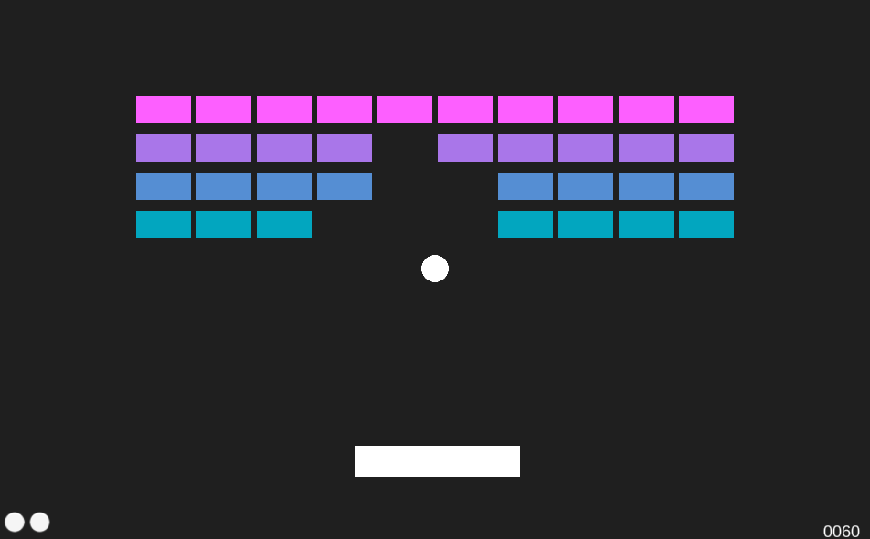

<h1 align="center">
    Breakout Clone (Unity Project)
</h1>

<h3 align="center">
    A Unity-based clone of the classic Breakout game, built to familiarize with Unity game engine and processes of game development.
</h3>

<p align="center">
    
    
    
    
</p>

<p align="center">

</p>

# Installation and Use

### Prerequisites
- **Unity**: Make sure you have Unity 2021.3 or a compatible version installed on your system.

### Installation
1. Clone the repository:
   ```bash
   git clone https://github.com/kutaycoskuner/study_breakout_unity.git
2. Import the project folder in Unity.

### Play
You can play the web version here:   
[https://kutaycoskuner.github.io/study_breakout_unity/](https://kutaycoskuner.github.io/study_breakout_unity/)

# Why?
This project is created with the sole purpose of familiarizing myself with the Unity game engine and understanding the basics of game development. It includes a functional game featuring `user interface`, `menu`, and `playable level` with win and lose conditions.

